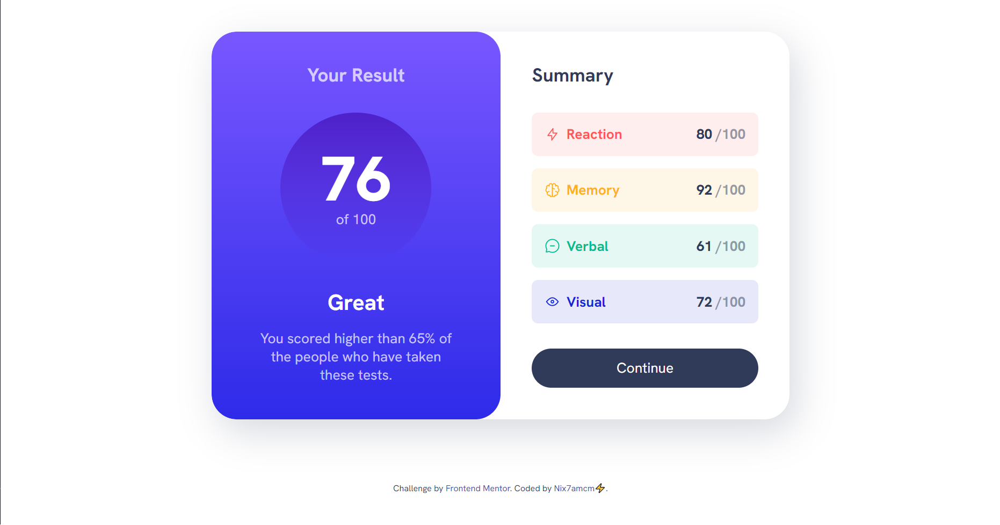
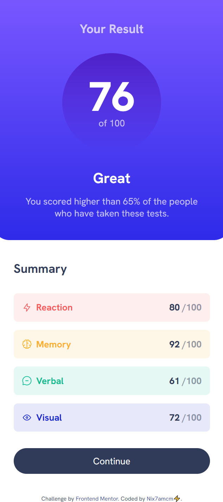

# Frontend Mentor - Results Summary Component solution

This is my solution to the [Results summary component challenge on Frontend Mentor](https://www.frontendmentor.io/challenges/results-summary-component-CE_K6s0maV). 

## Table of contents

- [Overview](#overview)
- [Screenshot](#screenshot)
- [Links](#links)
- [Built with](#built-with)
- [Acknowledgments](#acknowledgments)

## Overview

👩🏻‍💻 [Frontend Mentor](www.frontendmentor.io) challenges help you improve your coding skills by building realistic projects.

⚡ This challenge was to build a single page Results Summary Component, with a button that has hover and focus states. There is also a data.json file for the option to use JavaScript to add the results and total score dynamically. I have not done this yet.

🚀 I built this with the help of [@KevinPowell](https://www.youtube.com/@KevinPowell)'s walkthrough video on his YouTube channel. It was especially helpful to learn more about the use of custom CSS properties, and to practice CSS Grid.

## Screenshots

## Links

- Solution URL: [https://www.frontendmentor.io/solutions/results-summary-component-Fk9kxCyygQ](https://www.frontendmentor.io/solutions/results-summary-component-Fk9kxCyygQ)
- Live Site URL: [https://nix7amcm.github.io/FEM-results-summary-component/](https://nix7amcm.github.io/FEM-results-summary-component/)

## Built with

- Semantic HTML5 markup
- CSS custom properties
- Flexbox
- CSS Grid

## Acknowledgments

Again, shoutout to [@KevinPowell](https://www.youtube.com/@KevinPowell)! 😃
Check out his video for this challenge [here on YouTube](https://www.youtube.com/watch?v=KqFAs5d3Yl8) 👈🏻
